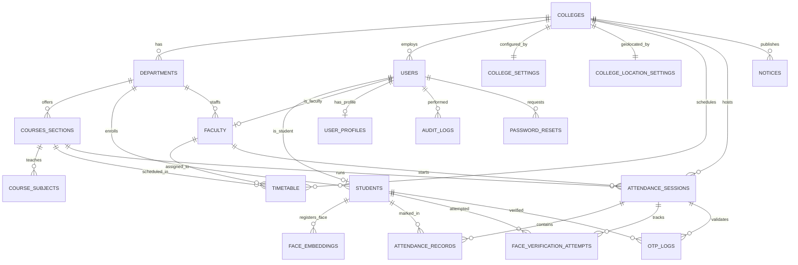

# Multi-College Attendance Management SaaS Platform
## System Architecture & Workflow — Complete Specification

> **Version:** 2.0  
> **Last Updated:** March 8, 2026  
> **Stack:** PHP 8.2 · MariaDB 10.4 · Vanilla JS · Face-API.js · HTML5 Geolocation API  
> **Deployment:** HTTPS-required LAMP/LEMP — single `api.php` entrypoint

---

## Table of Contents

1. [System Objective](#1-system-objective)
2. [High-Level Architecture](#2-high-level-architecture)
3. [Multi-Tenant Data Isolation](#3-multi-tenant-data-isolation)
4. [System Roles & Access Control](#4-system-roles--access-control)
5. [Database Schema (Entity-Relationship)](#5-database-schema-entity-relationship)
6. [API Endpoint Catalog](#6-api-endpoint-catalog)
7. [Authentication & Session Management](#7-authentication--session-management)
8. [Attendance Flow (14-Step Pipeline)](#8-attendance-flow-14-step-pipeline)
9. [Attendance Security Rules](#9-attendance-security-rules)
10. [Reporting & Analytics](#10-reporting--analytics)
11. [Notification System](#11-notification-system)
12. [Archive System (Soft-Delete)](#12-archive-system-soft-delete)
13. [System Logs & Audit Trail](#13-system-logs--audit-trail)
14. [Codebase Structure](#14-codebase-structure)
15. [Configuration Reference](#15-configuration-reference)
16. [Technology Decision Log](#16-technology-decision-log)

---

## 1. System Objective

The platform operates as a **secure, scalable, multi-college SaaS attendance system** that integrates:

- **Timetable automation** — per-department, per-semester scheduling with faculty assignment
- **OTP-gated access** — time-limited one-time password for session entry
- **GPS geofencing** — Haversine-formula distance validation against configurable campus radius
- **Face verification** — 128-dimensional embedding comparison using Face-API.js (TinyFaceDetector + FaceRecognitionNet)
- **Role-based dashboards** — four distinct interfaces with strict permission boundaries
- **Comprehensive audit trail** — every critical mutation logged with user, role, action, timestamp, and IP

All data is strictly isolated by `college_id`, ensuring zero cross-tenant data leakage.

---

## 2. High-Level Architecture

```
┌──────────────────────────────────────────────────────────────────────────┐
│                         CLIENT LAYER (Browser)                         │
│                                                                        │
│  ┌──────────┐  ┌──────────┐  ┌──────────┐  ┌──────────────────────┐   │
│  │ Super    │  │ College  │  │ Faculty  │  │ Student              │   │
│  │ Admin    │  │ Admin    │  │ Panel    │  │ • Mark Attendance    │   │
│  │ Panel    │  │ Panel    │  │          │  │ • Face Registration  │   │
│  └────┬─────┘  └────┬─────┘  └────┬─────┘  └──────────┬──────────┘   │
│       │              │              │                    │              │
│       │    ┌─────────┴──────────────┴────────────────────┘              │
│       │    │  HTML5 APIs: Geolocation · getUserMedia · Canvas           │
│       │    │  JS Libs:   Face-API.js (TinyFace + Landmark68 + FaceRec)│
└───────┼────┼───────────────────────────────────────────────────────────┘
        │    │
        ▼    ▼
┌──────────────────────────────────────────────────────────────────────────┐
│                       API GATEWAY (Single Entrypoint)                  │
│                                                                        │
│  backend/public/api.php                                                │
│  ┌──────────────────────────────────────────────────────────────────┐  │
│  │  1. Session::init() → SessionContext (auth + timeout)            │  │
│  │  2. ApiMiddleware → role enforcement                             │  │
│  │  3. Database migrations (ensure_* functions)                     │  │
│  │  4. enforce_active_college_for_session()                         │  │
│  │  5. switch($action) → route to handler                          │  │
│  └──────────────────────────────────────────────────────────────────┘  │
│                                                                        │
│  Controllers:  CollegeController                                       │
│  Services:     AuthService · AuditService · FaceVerificationService    │
│  Middleware:   ApiMiddleware                                           │
└───────────────────────────────┬──────────────────────────────────────────┘
                                │
                                ▼
┌──────────────────────────────────────────────────────────────────────────┐
│                         DATA LAYER (MariaDB)                           │
│                                                                        │
│  db_amsonline                                                          │
│  ┌────────────┐  ┌────────────┐  ┌────────────┐  ┌────────────────┐   │
│  │ colleges   │  │ users      │  │ students   │  │ faculty        │   │
│  │ departments│  │ timetable  │  │ attendance │  │ face_embeddings│   │
│  │ courses_   │  │ audit_logs │  │ _sessions  │  │ otp_logs       │   │
│  │ sections   │  │ platform_  │  │ attendance │  │ college_       │   │
│  │ course_    │  │ settings   │  │ _records   │  │ location_      │   │
│  │ subjects   │  │ notices    │  │            │  │ settings       │   │
│  │ college_   │  │ password_  │  │ face_      │  │ user_profiles  │   │
│  │ settings   │  │ resets     │  │ verification│ │                │   │
│  │            │  │            │  │ _attempts  │  │                │   │
│  └────────────┘  └────────────┘  └────────────┘  └────────────────┘   │
└──────────────────────────────────────────────────────────────────────────┘
```

### Request Lifecycle

```
Browser → POST /backend/public/api.php?action=<ACTION>
       → PHP Session validated (cookie-based, 30min timeout)
       → College status verified for non-super_admin users
       → Role checked via ApiMiddleware::requireRole()
       → Handler executes, returns JSON
       → AuditService::log() records the action
```

---

## 3. Multi-Tenant Data Isolation

### Core Principle

Every row that belongs to a college carries a direct or transitive `college_id` foreign key. The application enforces isolation at **three layers**:

| Layer | Mechanism | Implementation |
|-------|-----------|----------------|
| **Session** | `$_SESSION['college_id']` set at login | `Session.php` stores `college_id` in `SessionContext` |
| **Query** | `WHERE college_id = :cid` appended to all tenant-scoped queries | `Session::collegeScope()` returns SQL fragment + params |
| **Enforcement** | Active college check on every authenticated request | `enforce_active_college_for_session()` in `api.php` |

### Isolation Chain

```
colleges.id
  ├── departments.college_id     → departments scoped to college
  │     ├── courses_sections.dept_id  → courses inherit college scope
  │     │     └── course_subjects.course_id
  │     ├── students.dept_id     → students inherit college scope
  │     └── faculty.dept_id      → faculty inherit college scope
  ├── users.college_id           → all users carry college_id directly
  ├── timetable.college_id       → timetable entries scoped to college
  ├── attendance_sessions.college_id → sessions scoped to college
  ├── college_settings.college_id
  ├── college_location_settings.college_id
  └── notices.college_id         → announcements scoped to college
```

### Super Admin Exception

The Super Admin (`role = 'super_admin'`) has `college_id = NULL` and bypasses all college scoping. The `Session::collegeScope()` method returns an empty filter for `super_admin` role.

---

## 4. System Roles & Access Control

### 4.1. Super Admin

> Platform-wide governance. No `college_id` binding.

**Capabilities:**
- Create, edit, activate/deactivate, and archive colleges
- Generate College Admin credentials during college creation
- View platform-wide statistics (total colleges, users, sessions)
- Manage platform settings and system logs
- Drill into any college's departments, students, and faculty (read-only view)

**Sidebar Navigation:**

| Module | Description |
|--------|-------------|
| **Dashboard** | Platform stats: total colleges, active sessions, user counts |
| **Colleges** | CRUD college records, drill-down to departments/students/faculty |
| **Archive** | View & restore archived colleges |
| **System Logs** | Audit trail viewer with filters |
| **Platform Settings** | Global configuration (session timeout, platform name, etc.) |

**College Creation Flow:**

```
1. Super Admin fills form:
   ┌─────────────────────────────────────────────┐
   │ College Details                              │
   │  • Name            • Email                   │
   │  • Phone           • Address                 │
   │  • Logo (upload)   • Latitude / Longitude    │
   │  • Allowed Attendance Radius                 │
   ├─────────────────────────────────────────────┤
   │ Admin Credentials                            │
   │  • Admin Name      • Admin Email             │
   │  • Admin Password (auto-generated or manual) │
   │  • Admin Login ID (auto: COLADMIN###)        │
   └─────────────────────────────────────────────┘

2. Backend processing (CollegeController::save):
   a. BEGIN TRANSACTION
   b. INSERT INTO colleges → get college_id
   c. Save logo to assets/uploads/college_logos/
   d. INSERT INTO college_settings (short_code, contact_*)
   e. INSERT INTO users (role='college_admin', college_id)
   f. COMMIT
   g. AuditService::log('college_created')
   h. AuditService::log('superadmin_college_admin_created')

3. Response includes:
   { college_id, admin_unique_user_id, admin_password }
```

---

### 4.2. College Admin

> Full control within their assigned college only.

**Capabilities:**
- Manage departments (create, edit, archive)
- Manage students (create with auto-generated IDs, edit, archive, delete, generate credentials)
- Manage faculty (create with auto-generated IDs, edit, assign departments, archive, generate credentials)
- Create & manage timetable entries
- Configure college settings (location, thresholds, timers)
- Post notices/announcements
- View attendance reports (department-level, student-level, faculty-level)

**Sidebar Navigation:**

| Module | Description |
|--------|-------------|
| **Dashboard** | College stats: students, faculty, departments, today's sessions |
| **Departments** | Department CRUD with status toggle |
| **Students** | Student management with face registration status |
| **Faculty** | Faculty management with department assignment |
| **Timetable** | Weekly timetable builder per course/section |
| **Attendance Reports** | Dept stats, student %, faculty sessions |
| **Notices** | Create & archive announcements |
| **Settings** | College location, radius, thresholds, timers |
| **Archive** | View & restore archived students/faculty |

**Student ID Generation:**
```
Prefix: 3-char college code (from short_code or name initials)
Format: {PREFIX}{NNNNN}  →  e.g., YMN00001, YMN00002
Function: generate_student_unique_id()
```

**Faculty ID Generation:**
```
Prefix: 4-char (college code + 'F')
Format: {PREFIX}F{NNNNN}  →  e.g., YMNF00001
Function: generate_faculty_unique_id()
```

**College Settings:**

| Setting | Type | Default | Description |
|---------|------|---------|-------------|
| `latitude` | DECIMAL(10,8) | — | College center GPS latitude |
| `longitude` | DECIMAL(10,8) | — | College center GPS longitude |
| `radius_meters` | INT | 200 | Allowed geofence radius |
| `face_match_threshold` | DECIMAL(5,2) | 70.0 | Minimum face match % to accept |
| `otp_expiry_seconds` | INT | 300 | OTP validity window (5 min) |
| `grace_period_minutes` | INT | 10 | Late attendance grace period |

---

### 4.3. Faculty

> Scoped to assigned departments and subjects only.

**Capabilities:**
- View assigned weekly timetable
- View student list for their department
- Access student profiles (read-only)
- Start attendance sessions (OTP generation) during scheduled class time
- Close sessions manually or let auto-close at class end time
- View attendance history for their sessions

**Sidebar Navigation:**

| Module | Description |
|--------|-------------|
| **Dashboard** | Today's classes, active sessions, recent attendance |
| **My Timetable** | Weekly view of assigned classes |
| **Students** | Department student directory |
| **Start Attendance** | OTP generation for current/upcoming class |
| **Attendance History** | Past session records with student lists |

**Attendance Session Rules:**
1. **One session per slot** — duplicate sessions for the same timetable entry are rejected
2. **Time-bound start** — session can only start during (or near) the scheduled class window
3. **Manual close** — faculty can end session early
4. **Auto-close** — system closes session when `end_time` from timetable is reached
5. **OTP regeneration** — new OTP can be generated for the same active session

---

### 4.4. Student

> Personal scope only — own profile, face data, and attendance.

**Capabilities:**
- Login with provided unique ID + password
- Create/update personal profile (photo, phone, hobbies)
- Register face for attendance verification (multi-angle capture)
- View assigned timetable
- Mark attendance during active sessions (OTP → Location → Face)
- View attendance history with percentage breakdown

**Sidebar Navigation:**

| Module | Description |
|--------|-------------|
| **Dashboard** | Attendance summary: total, present, absent, percentage |
| **My Profile** | Edit personal details and photo |
| **Face Registration** | Multi-capture face embedding registration |
| **My Timetable** | Weekly class schedule |
| **Mark Attendance** | OTP entry → verification pipeline |
| **Attendance History** | Historical session-by-session records |

**Face Registration Rules:**
- Camera opens in **full-screen mode** (no mirroring)
- Captures **multiple images** for reliable embedding (front, angled)
- 128-dimensional embedding vector stored in `face_embeddings` table
- No raw images stored (privacy compliance)

---

## 5. Database Schema (Entity-Relationship)

### ER Diagram



### Table Definitions

#### Core Identity Tables

| Table | PK | Key Columns | Constraints |
|-------|-----|-------------|-------------|
| `colleges` | `id` (BIGINT AUTO) | `name`, `logo`, `contact`, `status` (active/inactive/removed), `archived_at` | `UNIQUE(name)` |
| `users` | `id` (BIGINT AUTO) | `unique_user_id`, `college_id` (FK→colleges), `name`, `email`, `password_hash`, `role` (super_admin/college_admin/faculty/student), `status` (active/suspended/pending), `deleted_at`, `last_login`, `profile_photo_data` | `UNIQUE(unique_user_id)`, `UNIQUE(email)` |
| `user_profiles` | `user_id` (FK→users) | `phone`, `hobbies`, `department_info` | — |

#### Academic Structure Tables

| Table | PK | Key Columns | Constraints |
|-------|-----|-------------|-------------|
| `departments` | `id` (BIGINT AUTO) | `college_id` (FK→colleges), `name`, `status` (active/inactive) | `UNIQUE(college_id, name)` |
| `courses_sections` | `id` (BIGINT AUTO) | `dept_id` (FK→departments), `course_name`, `year`, `semester`, `section` | `UNIQUE(dept_id, course_name, year, semester, section)` |
| `course_subjects` | `id` (BIGINT AUTO) | `course_id` (FK→courses_sections), `subject_name`, `subject_code` | `UNIQUE(course_id, subject_code)`, `UNIQUE(course_id, subject_name)` |
| `students` | `student_id` (BIGINT AUTO) | `user_id` (FK→users), `dept_id` (FK→departments), `course`, `year`, `semester`, `section`, `face_registered` | `UNIQUE(user_id)` |
| `faculty` | `faculty_id` (BIGINT AUTO) | `user_id` (FK→users), `dept_id` (FK→departments), `designation` | `UNIQUE(user_id)` |

#### Scheduling & Sessions

| Table | PK | Key Columns | Constraints |
|-------|-----|-------------|-------------|
| `timetable` | `id` (BIGINT AUTO) | `college_id`, `course_id`, `faculty_id`, `day_of_week` (0-6), `start_time`, `end_time`, `subject` | Indexed on `(college_id, day_of_week)` and `(course_id, faculty_id)` |
| `attendance_sessions` | `id` (BIGINT AUTO) | `college_id`, `faculty_id`, `course_id`, `subject`, `extra_reason`, `otp_code` (CHAR 6), `otp_expiry`, `start_time`, `end_time`, `status` (scheduled/active/closed/cancelled) | Indexed on `(college_id, status)` |

#### Attendance & Verification

| Table | PK | Key Columns | Constraints |
|-------|-----|-------------|-------------|
| `attendance_records` | `id` (BIGINT AUTO) | `session_id`, `student_id`, `timestamp`, `match_score`, `location_lat`, `location_lng`, `location_verified`, `status` (present/rejected/duplicate/late/invalid_otp/location_out_of_range) | **`UNIQUE(session_id, student_id)`** — prevents duplicate attendance |
| `face_embeddings` | `id` (BIGINT AUTO) | `student_id` (FK→students), `embedding_vector` (JSON, 128 floats), `embedding_type` (front/left/right/neutral/glasses), `registered_at` | `UNIQUE(student_id)` |
| `face_verification_attempts` | `id` (BIGINT AUTO) | `session_id`, `student_id`, `attempts_used` (max 3), `last_match_score`, `last_decision`, `locked`, `locked_reason` | `UNIQUE(session_id, student_id)` |
| `otp_logs` | `id` (BIGINT AUTO) | `session_id`, `student_id`, `verified`, `timestamp` | `UNIQUE(session_id, student_id)` |

#### Configuration & Support Tables

| Table | PK | Key Columns |
|-------|-----|-------------|
| `college_settings` | `college_id` (FK) | `short_code`, `contact_email`, `contact_phone` |
| `college_location_settings` | `college_id` (FK) | `latitude`, `longitude`, `radius_meters` (default 200) |
| `platform_settings` | `setting_key` (VARCHAR) | `setting_value` |
| `audit_logs` | `id` (BIGINT AUTO) | `user_id`, `action`, `ip_address`, `timestamp`, `metadata` (JSON) |
| `password_resets` | `id` (BIGINT AUTO) | `user_id`, `otp_hash`, `expires_at` |
| `notices` | `id` (BIGINT AUTO) | `college_id`, `title`, `content`, `created_by`, `archived_at` |

---

## 6. API Endpoint Catalog

All endpoints are accessed via:
```
POST /backend/public/api.php?action=<ACTION_NAME>
```

### 6.1. Authentication & Profile (All Roles)

| Action | Method | Auth | Description |
|--------|--------|------|-------------|
| `login` | POST | ❌ | Authenticate with `userId` + `password` |
| `logout` | POST | ✅ | Destroy session |
| `me` | GET | ✅ | Get current user info + college details |
| `request_password_reset` | POST | ❌ | Request OTP for password reset |
| `reset_password` | POST | ❌ | Reset password using OTP |
| `change_password` | POST | ✅ | Change password (authenticated) |
| `profile_get` | GET | ✅ | Get full profile data |
| `profile_update` | POST | ✅ | Update profile fields |
| `profile_photo_upload` | POST | ✅ | Upload profile photo (base64 data URL) |

### 6.2. Super Admin Endpoints

| Action | Method | Required Role | Description |
|--------|--------|---------------|-------------|
| `colleges_list` | GET | `super_admin` | List all colleges with status |
| `colleges_archive_list` | GET | `super_admin` | List archived colleges |
| `colleges_save` | POST | `super_admin` | Create or update a college |
| `colleges_remove` | POST | `super_admin` | Archive (soft-delete) a college |
| `colleges_restore` | POST | `super_admin` | Restore an archived college |
| `college_detail` | GET | `super_admin` | Full college details + admin info |
| `sa_departments_list` | GET | `super_admin` | Departments of a specific college |
| `sa_students_list` | GET | `super_admin` | Students of a specific college |
| `sa_faculty_list` | GET | `super_admin` | Faculty of a specific college |
| `superadmin_create_college_admin` | POST | `super_admin` | Create additional college admin |
| `superadmin_colleges_create` | POST | `super_admin` | Alternate college creation |
| `superadmin_colleges_update` | POST | `super_admin` | Alternate college update |
| `superadmin_colleges_delete` | POST | `super_admin` | Delete college |
| `platform_settings_get` | GET | `super_admin` | Read platform settings |
| `platform_settings_save` | POST | `super_admin` | Write platform settings |
| `super_admin_dashboard_summary` | GET | `super_admin` | Platform-wide statistics |
| `audit_logs_list` | GET | `super_admin` | View audit trail |

### 6.3. College Admin Endpoints

| Action | Method | Required Role | Description |
|--------|--------|---------------|-------------|
| `college_admin_dashboard_summary` | GET | `college_admin` | College-scoped stats |
| `college_admin_students_list` | GET | `college_admin` | Students in own college |
| `college_admin_student_create` | POST | `college_admin` | Create student + user account |
| `college_admin_student_update` | POST | `college_admin` | Update student details |
| `college_admin_faculty_list` | GET | `college_admin` | Faculty in own college |
| `college_admin_faculty_create` | POST | `college_admin` | Create faculty + user account |
| `college_admin_faculty_update` | POST | `college_admin` | Update faculty details |
| `college_admin_user_update` | POST | `college_admin` | Update any user in own college |
| `college_admin_user_delete` | POST | `college_admin` | Soft-delete user (set deleted_at) |
| `college_admin_user_purge` | POST | `college_admin` | Permanent delete |
| `college_admin_archive_list` | GET | `college_admin` | Archived users in own college |
| `college_settings_get` | GET | `college_admin` | Read college configuration |
| `college_settings_save` | POST | `college_admin` | Update college configuration |
| `college_admin_notice_create` | POST | `college_admin` | Post an announcement |
| `college_admin_notice_archive` | POST | `college_admin` | Archive a notice |
| `departments_list` | GET | `college_admin` | List departments |
| `departments_save` | POST | `college_admin` | Create/update department |
| `departments_delete` | POST | `college_admin` | Delete department |
| `courses_list` | GET | `college_admin` | List courses/sections |
| `courses_save` | POST | `college_admin` | Create/update course |
| `courses_delete` | POST | `college_admin` | Delete course |
| `course_subjects_list` | GET | `college_admin` | List subjects for a course |
| `course_subjects_save` | POST | `college_admin` | Add/update subject |
| `course_subjects_delete` | POST | `college_admin` | Delete subject |
| `timetable_list` | GET | `college_admin` | Full timetable for college |
| `timetable_create_manual` | POST | `college_admin` | Create timetable entry |
| `timetable_update_manual` | POST | `college_admin` | Update timetable entry |
| `timetable_delete` | POST | `college_admin` | Delete timetable entry |

### 6.4. Faculty Endpoints

| Action | Method | Required Role | Description |
|--------|--------|---------------|-------------|
| `faculty_classes_today` | GET | `faculty` | Today's scheduled classes |
| `faculty_class_options` | GET | `faculty` | Available class slots for session start |
| `faculty_department_students_list` | GET | `faculty` | Students in assigned department |
| `faculty_student_profile_get` | GET | `faculty` | View student profile |
| `faculty_timetable_weekly` | GET | `faculty` | Full weekly timetable |
| `faculty_active_session` | GET | `faculty` | Currently active session (if any) |
| `faculty_recent_sessions` | GET | `faculty` | Recent session history |
| `start_session` | POST | `faculty` | Start attendance session + generate OTP |
| `start_session_quick` | POST | `faculty` | Quick-start for current class slot |
| `end_session` | POST | `faculty` | Close active session |
| `session_results` | GET | `faculty` | View results for a specific session |
| `otp_preview` | GET | `faculty` | Preview OTP for active session |

### 6.5. Student Endpoints

| Action | Method | Required Role | Description |
|--------|--------|---------------|-------------|
| `student_dashboard_summary` | GET | `student` | Attendance stats & upcoming classes |
| `student_timetable_weekly` | GET | `student` | Personal weekly timetable |
| `face_register` | POST | `student` | Submit face embedding(s) for registration |
| `face_profile` | GET | `student` | Check face registration status |
| `submit_otp` | POST | `student` | Validate OTP for attendance |
| `verify_face` | POST | `student` | Submit live face embedding for match |
| `verify_location` | POST | `student` | Submit GPS coordinates for validation |
| `mark_attendance` | POST | `student` | Final attendance recording |
| `attendance_history` | GET | `student` | Personal attendance records |

### 6.6. Shared / Multi-Role Endpoints

| Action | Method | Allowed Roles | Description |
|--------|--------|---------------|-------------|
| `college_notices_list` | GET | `college_admin`, `faculty`, `student` | Notices scoped to college |
| `platform_notice_get` | GET | All authenticated | Platform-wide notice |
| `attendance_criteria_filters` | GET | `college_admin`, `faculty` | Filter options for reports |
| `attendance_semester_criteria` | GET | `college_admin`, `faculty` | Semester-based attendance query |
| `attendance_records_view` | GET | `college_admin`, `faculty` | Detailed attendance records view |
| `users_overview` | GET | `super_admin`, `college_admin` | User count summary |
| `users_list` | GET | `super_admin`, `college_admin` | Paginated user list |
| `users_create` | POST | `super_admin`, `college_admin` | Create any user type |
| `users_update` | POST | `super_admin`, `college_admin` | Update any user |
| `users_delete` | POST | `super_admin`, `college_admin` | Delete user |
| `generate_unique_id` | GET | `super_admin`, `college_admin` | Auto-generate user ID |
| `generate_password` | GET | `super_admin`, `college_admin` | Auto-generate secure password |
| `college_admin_generate_unique_id` | GET | `super_admin` | Generate admin login ID |

---

## 7. Authentication & Session Management

### Login Flow

```
POST ?action=login
Body: { "userId": "YMN00001", "password": "..." }

1. AuthService::login()
2. Lookup user by unique_user_id
3. Verify status === 'active'
4. password_verify() against password_hash
5. For non-super_admin: verify college status === 'active' AND archived_at IS NULL
6. session_regenerate_id(true)
7. Store in $_SESSION: user_id, unique_user_id, role, college_id
8. Update users.last_login = NOW()
9. AuditService::log('login_success')
10. Return user object with college metadata
```

### Session Security

| Feature | Implementation |
|---------|----------------|
| **Cookie Name** | `SESSION_NAME` from config |
| **Inactivity Timeout** | `SESSION_TIMEOUT` (configurable, default 1800s) |
| **Session Regeneration** | `session_regenerate_id(true)` on login |
| **College Enforcement** | `enforce_active_college_for_session()` on every authenticated request |
| **Auto-Logout** | College deactivated/archived → session destroyed |

### Role Enforcement Pattern

```php
// In every endpoint handler:
$apiMiddleware->requireRole(['college_admin']);  // Throws 403 if not matching

// Behind the scenes:
Session::requireAuth($ctx);        // 401 if no session
Session::requireRole($ctx, $roles); // 403 if role not in allowed list
```

---

## 8. Attendance Flow (14-Step Pipeline)

```
┌─────────────────────────────────────────────────────────────────────┐
│                    ATTENDANCE MARKING PIPELINE                      │
│                                                                     │
│  SETUP PHASE (College Admin)                                        │
│  ┌─────────────────────────────────────────────────────────┐       │
│  │ Step 1: Create timetable for departments                │       │
│  │         Assign subjects to faculty members               │       │
│  └─────────────────────────────────────────────────────────┘       │
│                              ▼                                      │
│  SESSION PHASE (Faculty)                                            │
│  ┌─────────────────────────────────────────────────────────┐       │
│  │ Step 2: Faculty starts attendance session               │       │
│  │         System generates 6-digit OTP                    │       │
│  │         OTP has configurable expiry (default 5 min)     │       │
│  └─────────────────────────────────────────────────────────┘       │
│                              ▼                                      │
│  VERIFICATION PHASE (Student)                                       │
│  ┌─────────────────────────────────────────────────────────┐       │
│  │ Step 3:  Student opens attendance page, enters OTP      │       │
│  │ Step 4:  System validates OTP + confirms session active │       │
│  │          ├─ OTP wrong/expired → REJECT (OTP_EXPIRED)    │       │
│  │          └─ Session closed → REJECT (INVALID_SESSION)   │       │
│  │                                                         │       │
│  │ Step 5:  System requests browser geolocation            │       │
│  │ Step 6:  Compare GPS coords vs college center           │       │
│  │ Step 7:  Distance > radius → REJECT (OUTSIDE_RADIUS)   │       │
│  │          Distance ≤ radius → PROCEED                    │       │
│  │                                                         │       │
│  │ Step 8:  System auto-opens camera                       │       │
│  │ Step 9:  Face verification against stored embedding     │       │
│  │ Step 10: Ensure single face in frame                    │       │
│  │ Step 11: Match ≥ threshold → ACCEPT                     │       │
│  │          Match < threshold → REJECT (FACE_MISMATCH)     │       │
│  └─────────────────────────────────────────────────────────┘       │
│                              ▼                                      │
│  RECORDING PHASE                                                    │
│  ┌─────────────────────────────────────────────────────────┐       │
│  │ Step 12: Record attendance with full metadata:          │       │
│  │          • student_id        • student_name             │       │
│  │          • subject           • faculty_id               │       │
│  │          • class_session_id  • timestamp                │       │
│  │          • face_match_score  • location_verified        │       │
│  │                                                         │       │
│  │ Step 13: Duplicate prevention enforced via              │       │
│  │          UNIQUE(session_id, student_id) constraint      │       │
│  │                                                         │       │
│  │ Step 14: Faculty dashboard auto-reflects new record     │       │
│  └─────────────────────────────────────────────────────────┘       │
└─────────────────────────────────────────────────────────────────────┘
```

### Face Verification Decision Matrix

```
Live Embedding (128-dim) ←→ Stored Embedding (128-dim)

Euclidean Distance = √(Σ(lᵢ - sᵢ)²)

Similarity Score = 100 / (1 + e^((distance - 0.55) / 0.09))

┌──────────────────┬──────────────┬──────────────┐
│ Score Range       │ Decision     │ Action       │
├──────────────────┼──────────────┼──────────────┤
│ ≥ 70% (ACCEPT)   │ MATCH        │ Proceed      │
│ 55% - 69% (RETRY)│ UNCERTAIN    │ Retry (max 3)│
│ < 55% (REJECT)   │ MISMATCH     │ New attempt  │
└──────────────────┴──────────────┴──────────────┘

Max attempts per session per student: 3
After 3 failures: Account LOCKED for that session
```

### Geolocation Validation

```
Student GPS: (lat_s, lng_s)
College GPS: (lat_c, lng_c) from college_location_settings
Radius:      R meters from college_location_settings

Distance = Haversine(lat_s, lng_s, lat_c, lng_c)

if (Distance ≤ R):
    location_verified = 1  →  PROCEED to face check
else:
    location_verified = 0  →  REJECT (OUTSIDE_RADIUS)
```

---

## 9. Attendance Security Rules

### Failed Attempt Logging

Every failed attendance attempt must be logged with a categorized failure reason:

| Failure Code | Trigger Condition | Logged In |
|-------------|-------------------|-----------|
| `OTP_EXPIRED` | OTP expiry datetime has passed | `otp_logs`, `audit_logs` |
| `INVALID_SESSION` | Session status ≠ 'active' or session not found | `audit_logs` |
| `OUTSIDE_RADIUS` | GPS distance > configured `radius_meters` | `attendance_records` (status), `audit_logs` |
| `FACE_MISMATCH` | Similarity score < `FACE_MATCH_ACCEPT_THRESHOLD` | `face_verification_attempts`, `audit_logs` |

### Anti-Fraud Measures

| Measure | Implementation |
|---------|----------------|
| **Duplicate Prevention** | `UNIQUE(session_id, student_id)` on `attendance_records` — database-level enforcement |
| **Attempt Throttling** | Max 3 face verification attempts per session per student — `face_verification_attempts.locked = 1` after 3 |
| **Session Binding** | OTP is session-specific; cannot reuse across sessions |
| **Time Binding** | Session auto-closes at scheduled `end_time` |
| **Single Face** | Camera stream must contain exactly 1 detected face |
| **No Image Storage** | Only 128-dim float vectors stored — reverse-engineering to photos is infeasible |
| **HTTPS Required** | Camera and Geolocation APIs require secure context |

---

## 10. Reporting & Analytics

### Faculty Reports

| Report | Data Source | Scope |
|--------|------------|-------|
| Daily Attendance | `attendance_records` JOIN `attendance_sessions` | Today's sessions by this faculty |
| Subject-wise Attendance | Grouped by `subject` column | All sessions by subject |
| Session History | `attendance_sessions` with record counts | Paginated past sessions |

### College Admin Reports

| Report | Data Source | Scope |
|--------|------------|-------|
| Department Statistics | `attendance_records` aggregated by `dept_id` | All departments in college |
| Student Attendance % | `(present_count / total_sessions) × 100` per student | All students in college |
| Faculty Sessions | `attendance_sessions` grouped by `faculty_id` | All faculty in college |

### Student Dashboard

| Metric | Calculation |
|--------|-------------|
| Total Classes | Count of sessions for student's course/section |
| Present | Count where `status = 'present'` |
| Absent | `total - present` |
| Attendance % | `(present / total) × 100` |

### Super Admin Dashboard

| Metric | Source |
|--------|--------|
| Total Colleges | `COUNT(colleges)` where status ≠ 'removed' |
| Total Students | `COUNT(users)` where role = 'student' |
| Total Faculty | `COUNT(users)` where role = 'faculty' |
| Active Sessions Today | `COUNT(attendance_sessions)` where status = 'active' AND date = today |

---

## 11. Notification System

### Notification Triggers

| Event | Recipients | Channel |
|-------|-----------|---------|
| Attendance session opens | Students in the course/section | Dashboard notification |
| Attendance marked successfully | Individual student | Dashboard notification |
| New notice posted by College Admin | All students/faculty in college | Dashboard + optional email |

### Implementation Strategy

Notifications are currently implemented as **pull-based** (dashboard polls or loads on page render). The architecture supports future extension to:
- **Email dispatch** via SMTP integration
- **Push notifications** via service workers (PWA)

---

## 12. Archive System (Soft-Delete)

### Philosophy

> No permanent `DELETE` commands on business-critical records. All removals are reversible archive operations.

### Archivable Entities

| Entity | Archive Mechanism | Restore |
|--------|-------------------|---------|
| **Colleges** | Set `status = 'removed'`, `archived_at = NOW()` | Set `status = 'active'`, `archived_at = NULL` |
| **Students** | Set `users.deleted_at = NOW()` | Set `users.deleted_at = NULL` |
| **Faculty** | Set `users.deleted_at = NOW()` | Set `users.deleted_at = NULL` |
| **Departments** | Set `status = 'inactive'` | Set `status = 'active'` |
| **Notices** | Set `archived_at = NOW()` | Set `archived_at = NULL` |

### Archive Flow

```
Archive Action:
  1. User clicks "Archive" in UI
  2. POST ?action=colleges_remove (or equivalent)
  3. Backend sets archived_at/deleted_at/status
  4. Record disappears from active lists
  5. AuditService::log() records the action

Restore Action:
  1. Navigate to Archive section
  2. Click "Restore" on archived record
  3. POST ?action=colleges_restore (or equivalent)
  4. Backend clears archived_at/deleted_at
  5. Record reappears in active lists

College Archive Cascade:
  When a college is archived/deactivated:
  → All users (college_admin, faculty, student) under that college are
    immediately blocked from login
  → enforce_active_college_for_session() destroys any active sessions
  → No data is altered; only access is revoked
```

---

## 13. System Logs & Audit Trail

### Log Storage

All audit data is persisted in the `audit_logs` table:

```sql
audit_logs (
    id          BIGINT UNSIGNED AUTO_INCREMENT PRIMARY KEY,
    user_id     BIGINT UNSIGNED NULL (FK → users.id, ON DELETE SET NULL),
    action      VARCHAR(255) NOT NULL,
    ip_address  VARCHAR(45) NULL,
    timestamp   DATETIME NOT NULL DEFAULT CURRENT_TIMESTAMP,
    metadata    JSON NULL
)
```

### Logged Actions

| Action Code | Trigger | Metadata |
|-------------|---------|----------|
| `login_success` | Successful login | `unique_user_id`, `role` |
| `login_failed` | Failed login | `unique_user_id`, `reason` |
| `logout` | User logout | — |
| `college_created` | New college created | `college_id` |
| `college_updated` | College details modified | `college_id` |
| `college_archived` | College soft-deleted | `college_id` |
| `college_restored` | College un-archived | `college_id` |
| `superadmin_college_admin_created` | Admin account created | `user_id`, `unique_user_id`, `college_id` |
| `student_created` | Student enrolled | `user_id`, `college_id` |
| `faculty_created` | Faculty added | `user_id`, `college_id` |
| `session_started` | Attendance session opened | `session_id`, `subject`, `course_id` |
| `session_ended` | Session closed | `session_id` |
| `attendance_marked` | Successful attendance | `student_id`, `session_id`, `match_score` |
| `attendance_failed` | Failed attendance attempt | `student_id`, `reason` |
| `face_registered` | Face embedding saved | `student_id` |
| `profile_updated` | Profile details changed | `user_id`, changed fields |
| `password_changed` | Password updated | `user_id` |
| `password_reset_requested` | Reset OTP generated | `user_id` |

### Log Entry Structure

Each log entry contains:
- **`user_id`** — The actor who performed the action (NULL for failed logins)
- **`role`** — Derived from session context (stored in metadata)
- **`action`** — Machine-readable action code
- **`timestamp`** — Server-side UTC timestamp
- **`IP address`** — Client IP from `$_SERVER['REMOTE_ADDR']`
- **`metadata`** — JSON object with action-specific context

---

## 14. Codebase Structure

```
AMS/
├── index.html                          # SPA shell (128KB) — all role UIs
├── .env                                # Environment configuration
├── README.md                           # User-facing documentation
├── SYSTEM_ARCHITECTURE.md              # This file
│
├── backend/
│   ├── public/
│   │   └── api.php                     # Single API entrypoint (~5300 lines)
│   │                                   #   • Helper functions (L1-L662)
│   │                                   #   • Request routing (L670-L5326)
│   │                                   #   • 90+ action handlers
│   ├── src/
│   │   ├── Database.php                # PDO singleton connection
│   │   ├── Session.php                 # SessionContext + auth helpers
│   │   ├── Controllers/
│   │   │   └── CollegeController.php   # College CRUD + admin creation
│   │   ├── Middleware/
│   │   │   └── ApiMiddleware.php       # Role enforcement wrapper
│   │   └── Services/
│   │       ├── AuthService.php         # Login + credential verification
│   │       ├── AuditService.php        # Audit trail logging
│   │       └── FaceVerificationService.php  # Face match + geofencing logic
│   ├── config/
│   │   └── config.php                  # DB credentials, session config, constants
│   └── schema_updated.sql             # Complete database DDL (720 lines)
│
├── assets/
│   ├── css/
│   │   ├── styles.css                  # Main application styles
│   │   └── face-verification.css       # Face verification UI
│   ├── js/
│   │   ├── app.js                      # Main SPA logic + routing
│   │   └── face-verification.js        # Face-API.js integration
│   ├── models/                         # Face-API.js model weights
│   │   ├── tiny_face_detector_model-*
│   │   ├── face_landmark_68_model-*
│   │   └── face_recognition_model-*
│   ├── img/                            # Static images
│   └── uploads/
│       ├── profile_photos/             # User profile photos
│       └── college_logos/              # College logo files
│
└── scripts/
    ├── backup_mysql.sh                 # Database backup script
    ├── fix_college_location_settings.sql
    ├── migrate_profile_photos_to_db.php
    └── test_remote_deployment.sh       # Deployment validation
```

### Key Architecture Patterns

| Pattern | Implementation |
|---------|----------------|
| **Single Entry Point** | All API traffic routes through `api.php` via `?action=` parameter |
| **Lazy Migration** | `ensure_*` functions auto-create tables/columns on first request |
| **Session-Based Auth** | PHP native sessions with cookie transport (no JWT) |
| **College Scope Helper** | `Session::collegeScope()` returns SQL fragment for tenant isolation |
| **Active College Guard** | `enforce_active_college_for_session()` runs before every handler |
| **Transaction Safety** | College creation + admin account creation wrapped in `BEGIN/COMMIT` |
| **Audit Trail** | `AuditService::log()` called after every state mutation |

---

## 15. Configuration Reference

### Environment Variables (`.env`)

| Variable | Default | Description |
|----------|---------|-------------|
| `DATABASE_HOST` | `localhost` | MySQL/MariaDB host |
| `DATABASE_USER` | — | Database username |
| `DATABASE_PASSWORD` | — | Database password |
| `DATABASE_NAME` | `db_amsonline` | Database name |
| `APP_ENV` | `production` | Environment mode |
| `HTTPS_ONLY` | `true` | Require HTTPS for camera/location |

### Application Constants

| Constant | Value | Location |
|----------|-------|----------|
| `FACE_MATCH_ACCEPT_THRESHOLD` | 84.0% | `api.php:50` |
| `FACE_MATCH_RETRY_THRESHOLD` | 72.0% | `api.php:51` |
| `FACE_MAX_ATTEMPTS` | 3 | `api.php:52` |
| `SESSION_TIMEOUT` | 1800s | `config.php` |
| `SESSION_NAME` | configurable | `config.php` |
| `FRONTEND_ORIGIN` | configurable | `config.php` |
| `LOCATION_RADIUS_DEFAULT` | 200m | `college_location_settings` |

---

## 16. Technology Decision Log

| Decision | Rationale |
|----------|-----------|
| **PHP + MariaDB** | Existing infrastructure; widely deployable on shared hosting |
| **Single `api.php`** | Simplicity over framework overhead; all routing in one file |
| **PHP Sessions (not JWT)** | Server-side session state enables instant revocation on college deactivation |
| **Face-API.js (client-side)** | No server GPU required; embedding extraction happens in browser |
| **128-dim embeddings only** | Privacy-compliant — no raw images stored server-side |
| **Haversine formula** | Standard great-circle distance; accurate for campus-scale distances |
| **Lazy migrations** | `ensure_*` functions prevent deployment failures from missing columns |
| **Soft-delete everywhere** | Business requirement: no permanent data loss; all records recoverable |
| **`college_id` isolation** | Every tenant-scoped query includes college_id filter — architectural invariant |

---

> **End of System Architecture Document**
